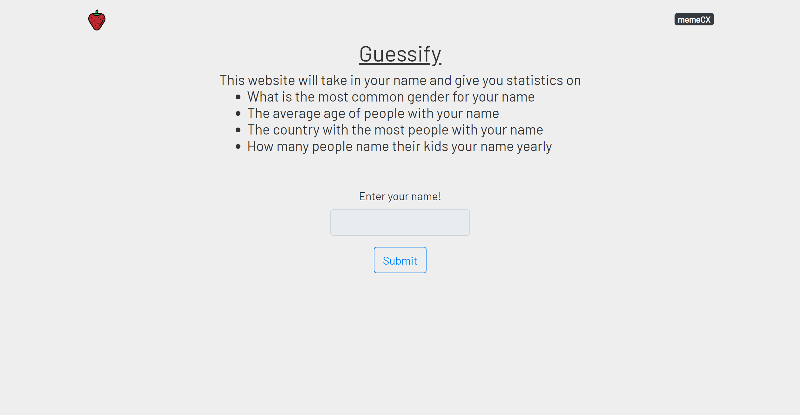

# Guessify

[]()

A fun application to find out information from your name!

## Technologies

- Bootstrap
- AJAX
- Javascript
- HTMl5
- CSS3

## Live Demo

Try the application here [https://gf.meme.cx/](https://gf.meme.cx/)

## Features

- Enter name to see:
- Stats about how common your name is
- Average age of people with your name
- Most common sex of people with your name
- Most common nationality of people with your name
- How common your name is per year

## Preview

[]()

## Development

### Getting Started

1. Clone the repository.

    ```shell
    git clone https://github.com/devin-kormos/guessify.git
    ```

1. Navigate to where you cloned it and you are done.
